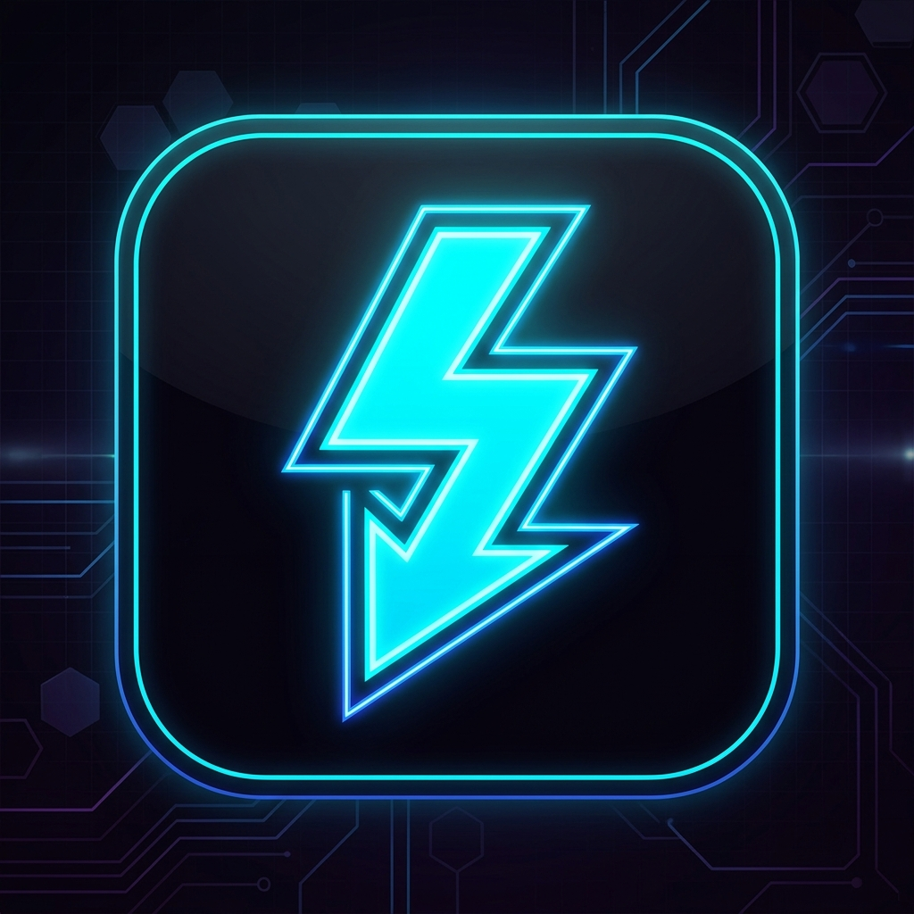

<div align="center">
  
  
  # FitDownloader

  **Lightning-Fast Bulk Download Manager with a Premium Gaming UI**

  [](https://github.com/yashbavale1578-png/FitDownloader)
  [](https://github.com/yashbavale1578-png/FitDownloader)
  [](https://opensource.org/licenses/MIT)

  <p align="center">
    <a href="#features">Features</a> •
    <a href="#installation">Installation</a> •
    <a href="#usage">Usage</a> •
    <a href="#building-from-source">Build</a> •
    <a href="#security">Security</a>
  </p>
</div>

---

## ⚡ Overview

**FitDownloader** is a sleek, high-performance desktop application designed for bulk downloading files seamlessly. Built with an aggressive, gaming-inspired aesthetic, it features advanced link extraction logic, automated Cloudflare challenge bypassing, and a robust asynchronous download queue manager.

Whether you're batch-downloading split archives or managing multiple large files, FitDownloader ensures your downloads are fast, uninterrupted, and visually satisfying.

---

## ✨ Features

- 🎮 **Premium Gaming UI:** A gorgeous, hardware-accelerated dark theme interface built with glassmorphism, dynamic animations, and vibrant accents.
- 🚀 **Lightning Fast:** Uses `undici` under the hood for highly optimized, non-blocking asynchronous downloads.
- 🔗 **Smart Link Extraction:** Automatically bypasses landing pages and CAPTCHAs/Cloudflare protections on top file hosting sites (e.g., FuckingFast.co, GoFile, PixelDrain, Buzzheavier).
- 📦 **Bulk Queuing System:** Paste hundreds of links at once. The Queue Manager handles concurrent downloads, auto-retries on failure, and tracks ETA/speed perfectly.
- ⏸️ **Pause & Resume:** Full support for pausing and resuming your ongoing transfers.
- 📁 **Smart File Management:** Automatically detects duplicate files, sanitizes filenames, and organizes your output seamlessly.

---

## 📥 Installation

1. Go to the [Releases](https://github.com/yashbavale1578-png/FitDownloader/releases) page.
2. Download the latest `FitDownloader-Setup-v1.1.0.exe`.
3. Run the installer. The app will launch automatically and create a Desktop shortcut.

---

## 🛠️ Building from Source

If you prefer to build the application yourself or want to contribute to the project, follow these steps:

### Prerequisites
- [Node.js](https://nodejs.org/) (v18 or higher)
- [Git](https://git-scm.com/)

### Setup

```bash
# 1. Clone the repository
git clone https://github.com/yashbavale1578-png/FitDownloader.git

# 2. Enter the directory
cd FitDownloader

# 3. Install dependencies
npm install

# 4. Run in development mode
npm run start
```

### Packaging for Release
To generate the Windows installer (`.exe`) using Electron Forge:

```bash
npm run make
```
The compiled binaries and setup executables will be generated in the `out/make/` folder.

---

## 🔒 Security

We take security seriously. Please refer to our [Security Policy](SECURITY.md) for information on reporting vulnerabilities securely.

---

<div align="center">
  <p>Built with ❤️ by Yash Arun Bavale</p>
</div>
